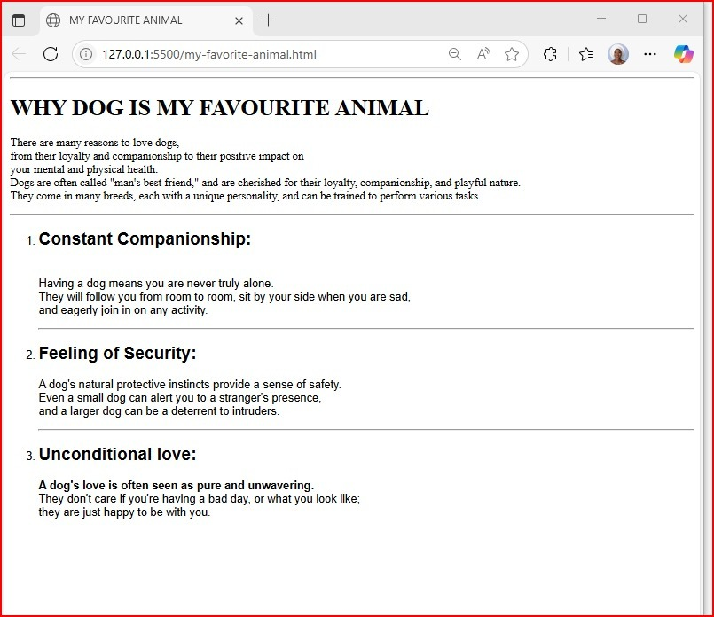
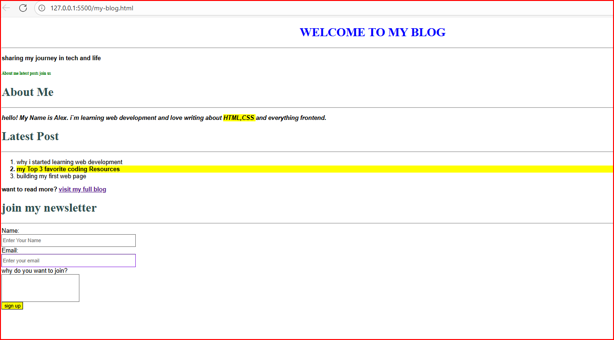

## 📂 Project Structure

Here’s what you’ll find in this repo:

My First Webpage Goal: Practice writing basic HTML structure and using text-related tags.
Task: Create a simple webpage about your favorite animal or food. The page should include:

• A page title (in the browser tab)  
• A main heading (<h1>)
• A few subheadings (<h2>or<h3>)
• At least two paragraphs describing the topic  
• A list (ordered or unordered)
Focus: HTML structure, headings, paragraphs, lists, images.

absolute path to this

> .\my-favourite-animal.html

## 📂 Project Structure
task: create the file send on your class. the page should include:
  A page of blog 
  A what am learning it html
  A latest post
  Focus: css design,linking css,list

  absolute path to this 
  
  >.\my-blog.html
  >.\my-blog.css
  
